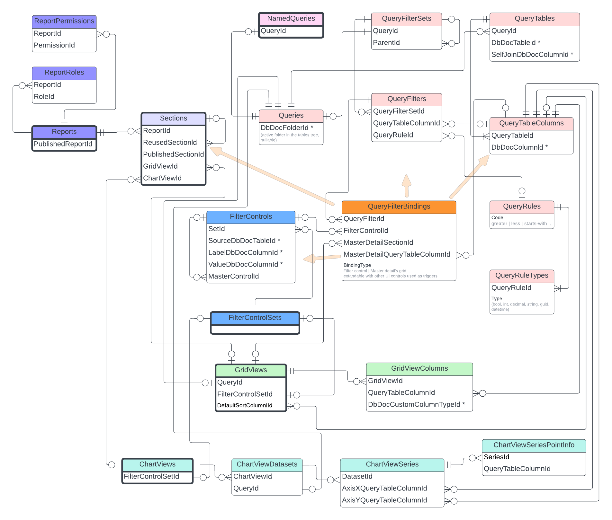

The feature serves the purpose of designing report pages in run-time. It is based on the reports builder UI.

Major points:
* It's supposed to be a tool for a user with a super admin role (at least in v1)
* Reports are created in a running application, a developer is not involved.
* In this v1 the reporting tool only works with the built-in reports builder. In the next versions, we may consider adding external reporting providers like Power BI.
* It uses DB Documenting tool to fetch DB tables schema (required) and representation metadata (optional)
* It uses DB Documenting table-container folder to manage the tables tree in the reports builder
* A report has a set of roles/permissions. The set determines the report's visibility in the menu and report page access
* In this v1 the report page can only be presented by a single grid with an external filter panel above
* The report query is driven by UI options. There is no raw SQL option. At least in v1.
* There is Parameters section in UI to define the WHERE of the query
* There is Filters section in UI to define the WHERE part of the query modified by the end-user by interacting with the filters panel of the report page.
* There is Table section in UI to define the grid's header and cells presentation.
* The filter panel supports dropdowns filled with data from a table linked to the filtered field. (If I filter order by customer then I link order.customerID filter to Customers table to fill the dropdown)
* It's possible to customize data format in cells by predefined formats of with HTML editor

Basic documentation is [here in wiki](https://wiki.bbconsult.co.uk/display/BLUEB/Reports+Builder).

### DB Schema
Lucid app source [here](https://lucid.app/lucidchart/183fb2ba-35db-4df7-827b-f4cbed694113/edit?viewport_loc=-349%2C565%2C1757%2C917%2CylMNKnidcEvO&invitationId=inv_e84f7d21-8d9b-409b-a4ab-fa602bae6a43).

